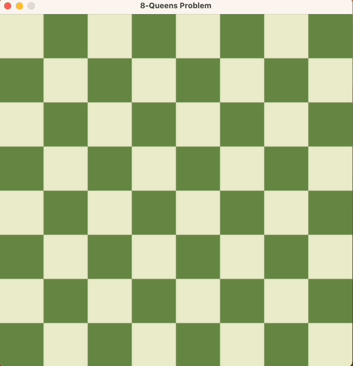

# 8 Queens Problem Solver - Backtracking Algorithm



## Introduction

The 8 Queens Problem Solver is a cool little project that aims to solve the classic 8 Queens Problem using a Backtracking Algorithm. The 8 Queens Problem is a puzzle that requires placing eight queens on an 8x8 chessboard in a way that no two queens threaten each other. This means no two queens are allowed to share the same row, column, or diagonal. The problem is a classic example of a constraint satisfaction problem and is often used to demonstrate backtracking algorithms.

## How to Use

1. Clone the repository to your local machine.
2. Make sure you have [Python](https://www.python.org/) installed (version 3.x recommended).
3. Navigate to the project directory in your terminal or command prompt.
4. Run the `8_queens_solver.py` script using Python:

```bash
python 8_queens_solver.py
```

5. The program will run the backtracking algorithm to find and display a solution for the 8 Queens Problem. It will print the chessboard with queens placed such that no two queens threaten each other.

## Backtracking Algorithm

The backtracking algorithm is a systematic way to find all possible solutions to a problem by trying out different options and undoing them if they fail to satisfy the given constraints. For the 8 Queens Problem, the backtracking algorithm works as follows:

1. Start with an empty chessboard.
2. Try placing a queen in the first row and the first column.
3. Check if the queen's placement is valid (no other queen threatens it).
4. If it's valid, move to the next row and repeat the process recursively.
5. If no valid placement is possible for the current row, backtrack to the previous row and try a different placement for the queen in the previous row.
6. Continue this process until all queens are placed successfully or all possibilities are exhausted.

The backtracking algorithm guarantees to find a valid solution for the 8 Queens Problem because it explores all possible combinations while adhering to the constraints of the problem.

## Contributions

Contributions to this project are welcome! If you have any ideas for improvement or new features, feel free to submit a pull request.

## License

This project is licensed under the [MIT License](LICENSE).

**Happy Problem Solving!** 🚀